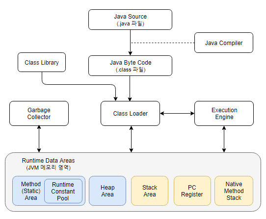

## 무엇인가
자바 컴파일러에 의해 번역된 바이트 코드를 OS에 맞게 해석해 주는 가상머신으로, Garbage Collection을 통해 자동으로 메모리 관리를 수행한다.

## 필요성
- 한 번 컴파일된 바이트 코드는 OS, HW 등 플랫폼에 독립적인 실행 환경을 제공

  - C언어는 컴파일 플랫폼과 타겟 플랫폼이 다르면 실행할 수 없다.
  - 반면, Java의 경우 한 번 컴파일된 바이트 코드는 윈도우, 리눅스 어디에서든 실행할 수 있다.
  - 각 플랫폼에 설치된 JVM이 OS에 맞는 실행 파일로 바꿔주기 때문에 플랫폼에 맞게 컴파일할 필요 없다.

_출처 : https://steemit.com/kr/@parkjp/java-jvm_

## 구성 요소
### Class Loader
- 바이트 코드로부터 클래스의 객체를 생성하며 메모리에 인스턴스를 올리는 작업을 수행한다.
  - 동적 로딩을 통해 필요한 클래스 파일을 로딩 및 링크하여 런타임 데이터 영역에 적재한다.

### Execution Engine
- Class Loader에 의해 적재된 바이트 코드를 해석해 명령어 단위로 실행한다.

#### 실행 방식
- 인터프리터
  - 바이트 코드 명령어를 하나씩 읽어 번역하고 실행한다.
  - 명령어 단위의 실행은 빠르나, 전체적인 실행 속도가 느린 단점
- JIT 컴파일러
  - JIT(Just-In-Time) : 어떤 메소드의 일부 혹은 전체 코드를 네이티브 코드로 변환하여 JVM에서 번역되지 않도록 함으로써 보다 빠른 성능을 제공하는 기법
  - 인터프리터 방식의 단점을 보완, 인터프리팅과 정적 컴파일 방식을 혼합한 것
    - 변환 작업은 인터프리터를 통해 지속적으로 수행하되, 필요한 코드의 정보는 캐시에 담아두었다가 재사용
  - 인터프리터 방식으로 실행하다가 적절한 시점에 필요한 바이트 코드 전체를 번역한 네이티브 코드를 캐시에 보관, 해당 메서드를 더 이상 인터프리팅하지 않고 네이티브 코드를 실행한다.
  - 장점
    - 바이트 코드를 하나씩 인터프리팅하는 것보다 네이티브 코드를 직접 실행하는 것이 빠르고, 네이티브 코드를 캐시에 보관하기 때문에 <u>매우 빠른 성능</u>을 보인다.
  - 단점
    - JIT 컴파일러의 컴파일 과정은 바이트 코드를 하나씩 인터프리팅하는 것보다 <u>훨씬 오래 걸리므로</u>, 한 번만 실행되는 코드라면 인터프리팅하는 것이 더 유리하다.

> **정적 컴파일 방식**
>
> 실행하기 전 네이티브 코드로 미리 변환하는 작업을 미리 수행한다. 따라서, 변환 작업은 딱 한 번만 수행된다.
{: .prompt-info }

### Garbage Collector
- Heap에 적재된 객체들 중 참조되지 않는 객체를 탐색 후 제거한다.

### Runtime Data Area
- JVM의 메모리 영역으로 애플리케이션을 실행할 때 사용되는 데이터가 적재된다.
- Method Area, Heap Area, Stack, PC Register, Native Method Stack으로 크게 나눈다.