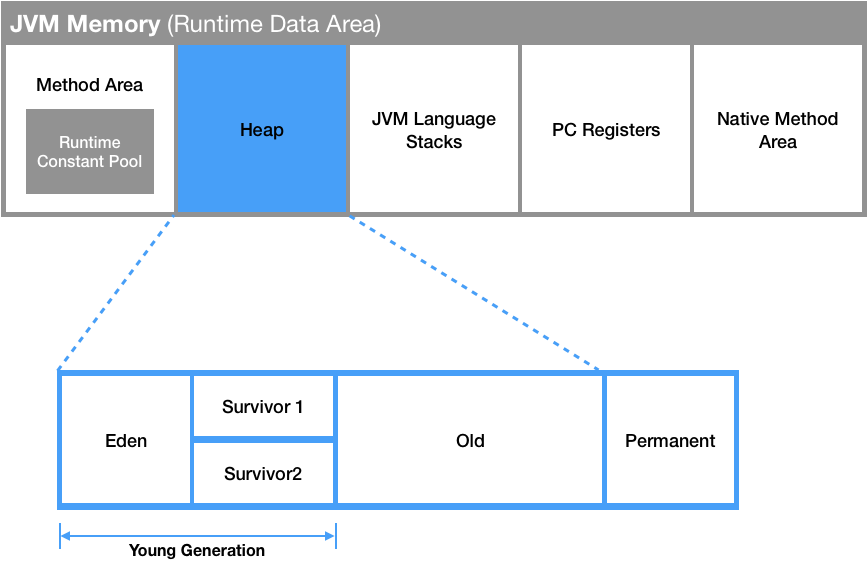
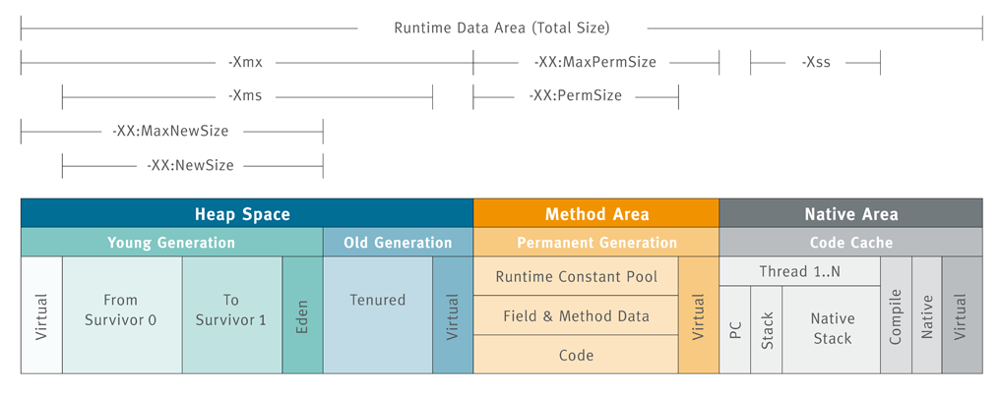
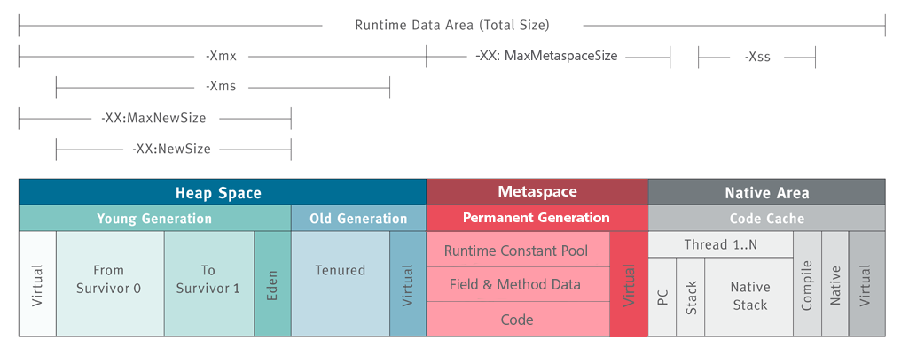

- JVM이 할당 받는 메모리 영역
- PC Register, JVM Stack, Native Method Stack는 스레드마다 하나씩 생성되며 Method Area, Heap는 모든 스레드가 공유해서 사용한다.

_출처 : https://inpa.tistory.com/entry/JAVA-%E2%98%95-JVM-%EB%82%B4%EB%B6%80-%EA%B5%AC%EC%A1%B0-%EB%A9%94%EB%AA%A8%EB%A6%AC-%EC%98%81%EC%97%AD-%EC%8B%AC%ED%99%94%ED%8E%B8_

## Method Area

- 실행 중인 프로그램의 메서드와 클래스 정보를 저장한다.
  - 필드 및 메소드 데이터, Runtime Constant Pool과 같은 클래스의 구조 정보
  - 정적 멤버 변수 (static), 상수 (static final) 포함
  - 메서드, 생성자의 바이트 코드
- JVM 벤더마다 다르게 구현되어 있다.
  - Oracle Hotspot JVM의 Method Area는 JDK 7까지는 PermGen, JDK 8부터 Metaspace로 대체
- 스레드 간 메모리를 공유한다.
- 할당 시점 : JVM 시작할 때
- 해제 시점 : JVM 종료될 때

### Runtime Constant Pool

  - 인스턴스 생성 시 참조하는 정보들을 상수로 보관한다.
  - 클래스/인터페이스의 메서드, 필드, 문자 리터럴 등의 레퍼런스를 저장
    - 즉, 어떤 메서드나 필드를 참조할 때 JVM은 Runtime Constant Pool을 통해 메서드, 필드의 실제 메모리의 레퍼런스를 참조한다.

## Heap

- 동적으로 생성되는 객체의 인스턴스, 배열 등을 저장한다.
- 스레드 간 메모리를 공유한다.
- `Garbage Collection` 의 대상이다.
- 할당 시점 : `new`로 인스턴스 또는 배열 생성 시
- 해제 시점 : 객체가 더 이상 사용되지 않거나, 명시적으로 null 선언 시

### 구조

#### Eden (Young Generation)

- 새로 생성된 객체가 최초로 저장되는 공간
- GC 이후 살아남은 객체들은 Survivor 영역(S1 or S2) 으로 이동

#### Survivor 1, 2 (Young Generation)

- 적어도 1번의 GC 이후 살아남은 객체가 저장되는 공간
- 둘 중 한 영역은 반드시 비어있다.
  - S1 또는 S2 중 한 영역이 꽉 차면 둘 중 살아남은 Survivor 영역으로 이동한다.

#### Old Generation

- Young Generation에서 오래 살아남은 객체가 저장되는 공간

> **Young, Old로 왜 나누었을까?**
> 
> 대부분의 객체 수명이 짧으므로, 오래 살아남는 객체와 빨리 죽는 객체를 분리하여 처리하면 Garbage Collector의 메모리 스캔 범위를 줄일 수 있어 효율적이다.
>  세대를 나누면 Young Generation은 자주 GC 수행하여 짧은 수명의 객체를 빨리 정리할 수 있으며, Old Generation은 덜 빈번하게 GC 수행하여 메모리를 효율적으로 관리할 수 있다.
{: .prompt-warning }

#### Permanent Generation (Java 8 이전)

_출처 : https://velog.io/@l_cloud/JDK%EB%A1%9C-%EA%B6%81%EA%B8%88%EC%A6%9D%EC%9D%84-%ED%95%B4%EA%B2%B0%ED%95%B4%EB%B3%B4%EC%9E%90_

- 저장 정보
  - 클래스, 메소드의 메타 데이터
  - static 객체, 상수 (static final)
  - 스트링 리터럴
  - JVM 내부 객체들과 JIT 최적화 정보
- 문제점 : 메모리 관리의 불편함
  - 스트링 리터럴, static Collection 객체들이 쌓여 `java.lang.OutOfMemory` 에러 발생

> **메타 데이터**
>
> 클래스의 구조, 메서드와 변수의 정보, 어노테이션 정보 등을 포함한 클래스와 관련된 정보를 말한다. JVM이 클래스를 로드하고 실행할 때 이 정보들을 참조한다.
{: .prompt-warning }

#### Metaspace (Java 8 이후)

_출처 : https://velog.io/@l_cloud/JDK%EB%A1%9C-%EA%B6%81%EA%B8%88%EC%A6%9D%EC%9D%84-%ED%95%B4%EA%B2%B0%ED%95%B4%EB%B3%B4%EC%9E%90_

- Java 8 이전의 Permanent Generation은 Java 8부터 Metaspace로 변경
- Native Memory 영역에 저장되어 OS에 의해 관리된다.
- Permanent Generation의 OOM 에러 현상을 개선하기 위해 static 객체, 상수화된 static 객체를 Heap으로 이동시켜 GC의 대상이 되도록 변경하고, 메타 데이터 정보들을 OS가 관리하는 영역으로 옮겨 Permanent Generation의 사이즈 한계를 해결했다.
- 저장 정보 변경 사항
  - 클래스, 메소드의 메타 데이터 - `Metaspace`
  - static 객체, 상수 (static final) - `Heap`
  - 스트링 리터럴 - `Heap`
  - JVM 내부 객체들과 JIT 최적화 정보 - `Metaspace`

## JVM Stack

_출처 : https://d2.naver.com/helloworld/1230_

- 스택 프레임(Stack Frame) 구조체를 저장하는 스택
  - JVM은 JVM Stack에 스택 프레임을 추가(push)하고 제거(pop) 동작만 수행한다.
- 메서드 호출 시 `스택 프레임`이 생성되어 해당 스레드의 JVM 스택에 추가된다.
- 각 스레드 별로 하나씩 보유한다.
- 할당 시점 : 스레드가 생성될 때
- 해제 시점 : 스레드가 종료될 때

### Stack Frame

- 호출된 메서드의 매개 변수, 지역 변수, 리턴 값, 연산 중 일어나는 값을 임시로 저장한다.
- 메서드 호출 시 생성되며 메서드가 종료되면 스택 프레임은 제거된다.
- 지역 변수 배열, 피연산자 스택의 크기는 컴파일 시에 결정되기 때문에 스택 프레임의 사이즈는 고정된다.
- 데이터 저장 방식
  - primitive type : 직접 값을 가진다.
  - reference type : 힙 영역 또는 메소드 영역의 객체 레퍼런스를 가진다.
- 구성 요소
  - *Local Variable Array*, 지역 변수 배열
    - 0번째 요소 : 메서드가 속한 클래스 인스턴스의 this 레퍼런스
    - 1번째 요소 ~ : 전달된 매개 변수가 저장된 후, 지역 변수가 차례로 저장
  - *Operand Stack*, 피연산자 스택
    - 메서드의 실제 작업 공간
    - 각 메서드는 피연산자 스택과 지역 변수 배열 사이에서 다른 메서드 호출 결과를 추가(push)하거나 꺼낸다(pop).
  - *Reference to Constant Pool*, 메서드가 속한 클래스의 Runtime Constant Pool에 대한 레퍼런스

## PC Register
- 스레드가 현재 수행하는 명령의 주소를 저장한다.
- 각 스레드 별로 하나씩 보유하며, 스레드가 시작될 때 생성된다.

## Native Method Stack
- Java 외의 언어(주로 C/C++ 등)로 작성된 Native 코드(JNI로 실행되는 코드)를 수행하기 위한 스택 영역
- 언어에 맞게 C 스택 또는 C++ 스택이 생성된다.

> **JNI (Java Native Interface)**
> 
> 다른 언어로 작성된 프로그램과 Java가 상호 작용할 수 있는 인터페이스를 제공
{: .prompt-warning }

#### 출처

- https://1-7171771.tistory.com/140
- https://inpa.tistory.com/entry/JAVA-%E2%98%95-JVM-%EB%82%B4%EB%B6%80-%EA%B5%AC%EC%A1%B0-%EB%A9%94%EB%AA%A8%EB%A6%AC-%EC%98%81%EC%97%AD-%EC%8B%AC%ED%99%94%ED%8E%B8
- https://d2.naver.com/helloworld/1230
- https://adjh54.tistory.com/280
- https://seunghyunson.tistory.com/23

