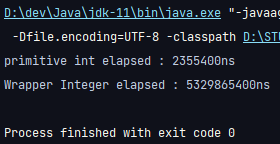

자바의 값을 나타내는 Wrapper 클래스, 프리미티브 타입에 대해 다시 리뷰하는 시간을 가졌다. 두 타입의 성능은 어떨까, 각각은 언제 사용하는 것이 좋을까 고민하다가 성능 측정을 진행하게 되었다. `int`와 `Integer` 타입 두 타입에 간단히 ++연산을 약 20억번 (자바 int형의 최대값) 더하여 각 타입의 연산 시간을 측정해보기로 했다.


## 성능 측정
### 소스 코드
- 성능 측정을 진행하기 위한 소스코드는 다음과 같다.
- 간단히 연산 수행 전, 후 나노초 시간을 측정하는 방식이다.
```java
public static void main(String[] args) {
    int intSum = 0;
    long startTime = System.nanoTime();
    for (int i = 0; i < Integer.MAX_VALUE; i++) {
        intSum += 1;
    }
    System.out.printf("primitive int elapsed : %dns\n", (System.nanoTime() - startTime));

    Integer integerSum = 0;
    startTime = System.nanoTime();
    for (int i = 0; i < Integer.MAX_VALUE; i++) {
        integerSum += 1;
    }
    System.out.printf("Wrapper Integer elapsed : %dns\n", (System.nanoTime() - startTime));
}
```

### 결과



코드를 20억번씩 돌려보니 확 차이가 났다.

프리미티브 타입은 약 2ms로 결과가 바로 떴으나, 레퍼런스타입은 5초 가량의 시간이 걸렸다.

프리미티브 타입이 약 2천배 가량 빠르게 나왔다.

GC 관점에서 봤을 때, 힙에 저장되는 레퍼런스 타입은 GC의 영향을 받지만 프리미티브 타입은 스택에 저장되어 GC의 영향을 받지 않는다.
또한 일반적으로 동적 할당으로 런타임에 메모리가 할당되어 상대적으로 복잡한 메모리 관리 방식인 힙은 정적 할당으로 메모리 관리가 간단한 스택에 비해 속도가 느리다고 알려져 있다.
실제로 두 타입의 성능을 측정해 보았다.


## 원인 분석
### 저장 공간의 특성
레퍼런스 타입은 힙에 저장된다. 힙은 동적 할당으로 런타임에 메모리가 할당되어 상대적으로 복잡한 메모리 관리 방식으로 정적 할당으로 메모리 관리가 간단한 스택에 비해 속도가 느리다고 알려져 있다. 힙의 처리 속도가 느리기 때문이지 않을까..?

### GC 관점
힙에 저장되는 레퍼런스 타입은 GC의 영향을 받지만, 프리미티브 타입은 스택에 저장되어 GC의 영향을 받지 않는다. 따라서 레퍼런스 타입은 GC의 스캔 대상이 되어 성능 저하의 원인이 될 수도 있을 것이다. 하지만 성능을 측정하는 짧은 코드 블록에서 GC의 영향 때문이라 판단되지는 않는다.

### Boxing, 불변 객체의 영향
Wrapper 타입에 1을 더할 때 오토 박싱이 일어난다. 또한 Wrapper 클래스는 불변 객체로, 값을 더한다면 새 메모리 공간에 객체를 새로 생성하여 더하기 연산을 처리하지 않을까? 그렇기 때문에 그런 과정이 존재하지 않는 프리미티브 타입에 비해 속도가 느릴 수 있을 것이라 추정된다.

또한, 불변 객체의 특성으로 인해 새 메모리 공간을 할당받게 되면서 사용되지 않는 객체가 발생한다. 이로 인하여 프로그램의 GC 성능에도 영향을 미칠 것 같다.

## 결론
성능 측정 결과를 보고 차이가 매우 크다는 것을 확인할 수 있었다.

가급적이면 프리미티브 타입을 사용하되, 필요시 Wrapper 클래스를 사용하는 것이 좋을 것 같다는 결론을 내렸다.

Wrapper 클래스는 레퍼런스 타입으로 null을 표현 할수 있다는 점. null 이 꼭 필요할 때 Wrapper 클래스를 사용하면 좋을 것 같다.

이번 분석을 진행하면서 박싱, GC, 불변 객체의 특성 등 코드 한 줄 한 줄에도 성능을 생각해야 하는 포인트가 많다는 것을 느낄 수 있었다.
