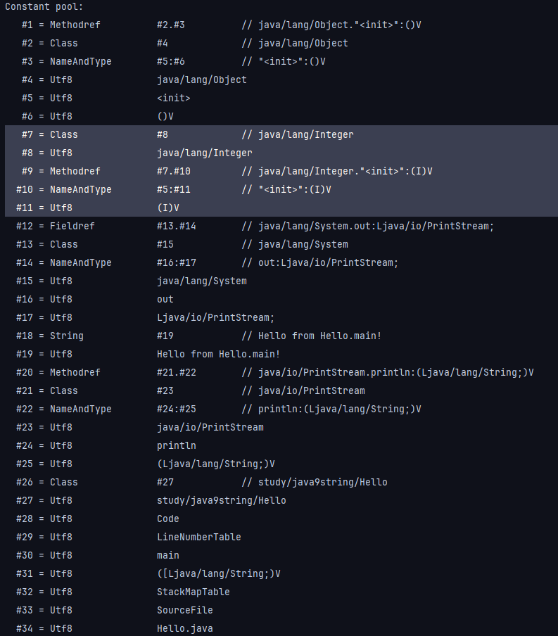

Runtime Constant Pool, Constant Pool, String Pool 등 JVM을 학습하며 비슷하면서 다른 용어가 많이 나와서 혼동되었습니다. 또한 단순히 문자열, 숫자, 메소드의 참조가 저장된다는 의미가 와닿지 않아 상수 풀에 어떻게 저장되는지 직접 한 번 보면서 정리하고자 합니다.


## Constant Pool, 상수 풀이란
*constant pool*은 클래스의 심볼 테이블 역할을 수행하기 위해 참조되는 클래스의 이름, String과 숫자 상수의 초기값과 실행에 필요한 다양한 데이터가 들어가 있습니다.

### 역할
1. 상수 풀의 값은 상수가 여러 번 사용될 때 상수 풀에서 바로 가져와 메모리를 절약할 수 있습니다.
2. 클래스, 인터페이스 이름, 메서드 및 필드 참조 등을 효율적으로 관리하여 성능을 최적화합니다.

## 용어 정리
### Constant Pool
- 클래스, 메서드, 숫자 등 다양한 상수가 저장된 클래스 파일 내부에 존재하는 영역을 의미합니다. 소스 코드를 컴파일할 때 상수 풀에 문자열 리터럴, 상수 값, 클래스 및 메서드 참조 등을 저장합니다.
- 클래스 로더에 의해 JVM에 로드될 때 Constant Pool의 모든 상수, 레퍼런스들을 참조합니다.


_출처 : https://deveric.tistory.com/123_

### Runtime Constant Pool
- 클래스를 로드할 때 Constant Pool을 기반으로 메모리(JVM 메소드 영역)에 로드된 자료 구조를 의미합니다.
- 각 클래스 / 인터페이스마다 별도로 존재하며, 말 그대로 런타임에 사용하는 자료 구조로 메서드 호출, 필드 참조 시에 런타임 상수 풀을 참조합니다.

### String Constant Pool
- String 리터럴만 저장하는 공간입니다. Heap 내부에 독립적으로 존재하는 공간으로 Runtime Constant Pool과 다릅니다.
- `String str = "hello;"`로 생성한 문자열은 String Constant Pool에 저장되고, `new`로 생성한 문자열은 Heap에 저장됩니다. String Constant Pool에 저장된 문자열과 동일한 스트링 객체 `String str2 = "hello";` 생성 시 메모리를 재할당하지 않고 String Constant Pool에 저장된 리터럴을 참조합니다.

## 상수 풀을 보자
### 예제 코드
```java
public class Hello {
    public static void main(String[] args) {
        // Object o = new Object();
        // Integer k = new Integer(1);

        for (int i = 0; i < 10; i++) {
            System.out.println("Hello from Hello.main!");
        }
    }
}
```

상수 풀을 보기 위한 간단한 예제 코드입니다. 상수 풀의 차이를 보기 위해 `Object o, Integer k` 코드는 나중에 하나씩 주석을 해제하며 상수 풀의 차이를 보도록 하겠습니다.

### 명령어
```bash
$ javac Hello.java
$ javap -v Hello.class
```
`javap -v` 을 통해 역어셈블을 수행합니다. `-v` 옵션을 통해 상수 풀, 필드, 로우 레벨 명령어 코드 등의 상세 정보를 얻을 수 있습니다.

> **역어셈블이란?**<br/>
> 컴파일된 바이트 코드를 사람이 읽을 수 있는 형태의 어셈블리어와 유사한 코드로 변환하는 과정입니다. 이 과정을 통해 클래스 파일의 내용을 이해하고 분석합니다. 이를 기반으로 디버깅, 성능 최적화, 보안 분석 등을 수행할 수 있습니다.
{: .prompt-tip }

### 결과


앞 부분에 수정된 날짜, 사이즈, 체크섬, 슈퍼 클래스, 메소드 정보 등이 나오며, 그 뒤에 Constant Pool (상수 풀) 정보가 뜨고 있습니다.


그 뒤에는 상수 풀에 등록된 심볼로 구성된 Hello 클래스와 main 메소드에 대한 기계어가 사람이 읽을 수 읽는 형태로 나와 있는 것을 확인할 수 있습니다. `#번호` 형태로 상수 풀 엔트리를 참조하는 것을 확인할 수 있습니다.

## 상수 풀 데이터 분석
```
   (1)     (2)               (3)          (4)
   #1 = Methodref          #2.#3          // java/lang/Object."<init>":()V
   #2 = Class              #4             // java/lang/Object
   #3 = NameAndType        #5:#6          // "<init>":()V
   #4 = Utf8               java/lang/Object
   #5 = Utf8               <init>
   #6 = Utf8               ()V
   #7 = Fieldref           #8.#9          // java/lang/System.out:Ljava/io/PrintStream;
   #8 = Class              #10            // java/lang/System
   #9 = NameAndType        #11:#12        // out:Ljava/io/PrintStream;
  #10 = Utf8               java/lang/System
  #11 = Utf8               out
  #12 = Utf8               Ljava/io/PrintStream;
  #13 = String             #14            // Hello from Hello.main!
  #14 = Utf8               Hello from Hello.main!
  #15 = Methodref          #16.#17        // java/io/PrintStream.println:(Ljava/lang/String;)V
  #16 = Class              #18            // java/io/PrintStream
  #17 = NameAndType        #19:#20        // println:(Ljava/lang/String;)V
  #18 = Utf8               java/io/PrintStream
  #19 = Utf8               println
  #20 = Utf8               (Ljava/lang/String;)V
  #21 = Class              #22            // study/java9string/Hello
  #22 = Utf8               study/java9string/Hello
  #23 = Utf8               Code
  #24 = Utf8               LineNumberTable
  #25 = Utf8               main
  #26 = Utf8               ([Ljava/lang/String;)V
  #27 = Utf8               StackMapTable
  #28 = Utf8               SourceFile
  #29 = Utf8               Hello.java
```

각 행의 맨 앞에는 `#행번호`를 나타내고, `=` 뒤에 해당 데이터의 유형을 나타내는 *type descriptor*가 들어가 있습니다. 이후 3번째 칼럼은 각 항목의 값을 나타냅니다. `//` 뒤에는 참조하는 내용을 레퍼런스하여 나타내고 있습니다.

심볼 테이블에서 가장 많이 눈에 띄는 유형은 `Utf8`입니다. 이 유형은 클래스 파일에서 스트링 데이터를 표현하기 위한 내부적인 포맷입니다.

### 스트링 변환

Utf8을 제외한 다른 모든 유형(`Methodref, Fieldref, String, …`)들은 Utf8 엔트리로 해석됩니다.

```
  #21 = Class              #22            // study/java9string/Hello
  #22 = Utf8               study/java9string/Hello
```

예를 들어, `#21 Class` 엔트리는 `#22`를 참조합니다. `#22` 엔트리는 “Hello”로 검사 중인 클래스 이름을 나타냅니다. 클래스 이름 앞에 슬래시로 구분된 패키지 경로 `study/java9string` 가 같이 붙습니다.

### MethodRef

```
  #15 = Methodref          #16.#17        // java/io/PrintStream.println:(Ljava/lang/String;)V
```
`#15 Methodref`는 println() 메서드에 대한 참조 정보로 `#16.#17` 로 구성됩니다.

- `#16` 엔트리 `java/io/PrintStream`
  
    `Class` 유형으로 println() 메서드가 속한 클래스의 정보가 자바 패키지 경로와 함께 담겨 있습니다.
    
- `#17` 엔트리 `println:(Ljava/lang/String;)V`
  
    `NameAndType` 유형으로 메소드의 이름과 시그니쳐가 담겨 있습니다. 함수명과 파라미터, 리턴 타입 정보입니다.

**`#17` 엔트리 분석**

```
println:(Ljava/lang/String;)V
```

- 괄호 내부에 대문자로 메소드 파라미터 타입이 표현됩니다. 괄호 안에 `L`로 시작하고, 세미콜론으로 끝나고, 괄호 뒤에 `V`가 표시되는 부분이 눈에 띕니다. `L, V`는 엔트리의 타입을 나타내는 *type descriptor*입니다.
- `L`은 객체를 나타내는 type descriptor입니다. String은 객체이기 때문에 `L`로 표현됩니다.
- 괄호 뒤에 붙은 `V`는 리턴 타입 void 를 나타냅니다.
- 만약 println() 메서드가 float 형을 받았다면 해당 메소드의 시그니처 아래의 Primitive Type descriptor에 따라 `(F)V`로 표현됩니다.

**Primitive Type descriptor**

메소드 레퍼런스에 포함된 대문자 중 Primitive Type은 다음 문자로 표현됩니다.

- `B` (byte)
- `C` (char)
- `D` (double)
- `F` (float)
- `I` (int)
- `J` (long)
- `S` (short)
- `Z` (Boolean)

**String 배열이 파라미터로 들어오면?**

```
([Ljava/lang/String;)V
```

- 여는 브라켓 `[`이 괄호 안에 들어갑니다.

### 생성자는?
```
   #1 = Methodref          #2.#3          // java/lang/Object."<init>":()V
```
`#1`엔트리는 `java.lang.Object`의 디폴트 생성자를 나타냅니다.

디폴트 생성자의 `NameAndType`은 `"<init>":()V` 로 표시되고 있습니다. 디폴트 생성자의 이름은 `<init>`임을 알 수 있는데, 소스 코드에서는 `<` 사용을 막기 때문에 자바 코드에서 볼 수 없습니다. 따라서 컴파일러가 디폴트 생성자를 자동으로 만든 부분이 흥미롭네요.

**디폴트 생성자는 어디서 호출될까?**

Hello 클래스의 생성자가 없으므로 컴파일러는 최상위 슈퍼 클래스의 디폴트 생성자를 찾아서 호출하기 위해 `Object` 클래스의 `"<init>"` 메소드 레퍼런스를 생성합니다.

### FieldRef
```
   #7 = Fieldref           #8.#9          // java/lang/System.out:Ljava/io/PrintStream;
```
자바 소스코드는 `System.out.println()`을 호출하지만 println() 메소드는 `java.io.PrintStream`클래스에 위치합니다.

실제 static 필드 사용을 위해 `System.out` 에서 `java.io.PrintStream`으로 변환하는 과정은 `#7` 엔트리를 통해 확인할 수 있습니다.

### Single Byte Tag
바이트 코드에서 type descriptor인 `Utf8, Methodref`등은 1 byte tag로 표현됩니다.
더 자세히 알고 싶다면 다음 공식 문서 [링크](https://docs.oracle.com/javase/specs/jvms/se17/html/jvms-4.html#jvms-4.4)를 참조 바랍니다.

### Object o 코드(3번째 줄)를 추가하면?
```java
public class Hello {
    public static void main(String[] args) {
        Object o = new Object();
        // Integer k = new Integer(1);

        for (int i = 0; i < 10; i++) {
            System.out.println("Hello from Hello.main!");
        }
    }
}
```
`Object` 타입의 객체를 생성했으나 상수 풀은 더 추가되지 않아 바뀌지 않은 것을 알 수 있습니다.


다만 Object o 객체를 생성하기 위한 기계어는 추가된 것을 확인할 수 있습니다. 기존에 상수 풀에 생성되었던 `#1, #2` 심볼을 활용합니다. 기존 상수 풀을 재활용하는 모습을 통해 상수 풀의 필요성을 알 수 있었습니다.

### Integer k 코드(4번째 줄)를 추가하면?
```java
public class Hello {
    public static void main(String[] args) {
        Object o = new Object();
        Integer k = new Integer(1);

        for (int i = 0; i < 10; i++) {
            System.out.println("Hello from Hello.main!");
        }
    }
}
```

`#7`부터 `#11`까지 5개의 엔트리가 추가되었습니다. 앞서 봤던 메소드, 클래스 레퍼런스와 같은 방식으로 Integer 클래스의 상수, 생성자 메소드 표현을 위한 상수들이 추가된 것을 확인할 수 있습니다. Integer의 생성자 정보인 `#10 NameAndType` 타입 데이터를 보면, 정수 파라미터를 받기 때문에 `(I)`로 표시된 점이 Object 클래스의 디폴트 생성자와 다릅니다.

### Integer k = 1로 바꾸면?

`Integer k = new Integer(1);` 코드를 추가 한 후 컴파일하면 deprecated 되었다고 뜨는 것을 발견했습니다. 그 이유는 기존 new 생성 방식보다 valueOf() 메소드의 사용으로 이미 생성된 Integer 객체를 캐싱하여 객체 생성 비용을 줄이고 메모리 사용을 최적화할 수 있기 때문에 new를 사용하는 방식은 권장되지 않습니다.

deprecate 된 부분은 이 포스트의 핵심이 아니고, 갑자기 `Integer k = 1;`로 바꾸면 컴파일러가 내부적으로 어떻게 처리할까 궁금해졌습니다. 그냥 한 번 호기심에 아래와 같이 코드를 바꾸고 돌려보았습니다.

```java
public class Hello {
    public static void main(String[] args) {
        Object o = new Object();
        Integer k = 1;

        for (int i = 0; i < 10; i++) {
            System.out.println("Hello from Hello.main!");
        }
    }
}
```


바로 앞에서 봤던 상수 풀과 엔트리가 일부 다릅니다!! `Integer k = 1;`로 작성시 컴파일러는 `new Integer(1)`로 객체를 생성하지 않고 더 최적화된 방식인 `Integer.valueOf(1)`로 컴파일하기 위해 상수 풀에 `valueOf()` 메소드 레퍼런스를 올리는 것을 확인할 수 있습니다.

내부적으로 어떻게 컴파일러가 코드를 짜 주는지 간접적으로 확인한 부분이 흥미로웠습니다.

## 더 궁금한 것 (혼잣말)
스트링 리터럴은 Constant Pool에도 저장되고 String Constant Pool에도 저장되는 것처럼 기술되어 있다. 포스트에 기술하지 않았지만, JVM Spec 문서에 따르면 Constant Pool에 저장될 때 구조체에 상수들이 저장되는 것으로 나오는데, 거기에 스트링 리터럴도 저장된다.<br/>그런데 그 구조체는 Constant Pool에만 저장되는 것으로 보인다.(아닐 수도...) 그 데이터가 String Constant Pool에 저장되는 것은 아닌 것 같은데...? 흠...

정리하자면, 지금까지 본 내용만으로 Constant Pool에 저장된 스트링 리터럴이 어떻게 String Constant Pool에 저장되는지 알 수 없다. 스트링 리터럴은 두 군데 다 저장되는데, Runtime Constant Pool과 어떤 관계이고 String Constant Pool에 어떻게 저장되는지 궁금했다. 시간 될 때 추가적으로 알아봐야겠다.

## 참고 자료
- https://blogs.oracle.com/javamagazine/post/java-class-file-constant-pool
- https://docs.oracle.com/en/java/javase/17/docs/specs/man/javap.html
- https://blog.naver.com/hazard11/80028989392
- https://deveric.tistory.com/123
- ChatGPT