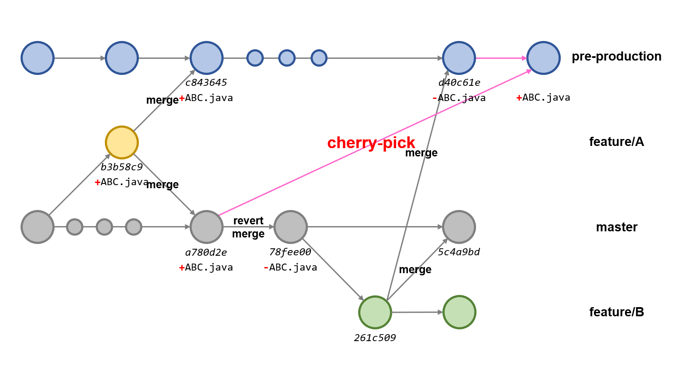

1. feature/A 브랜치를 pre-production 브랜치, master 브랜치에 merge 한다.
2. master 브랜치에서 merge commit을 revert 한 후, master 브랜치에서 딴 feature/B 브랜치에서 다른 기능을 커밋한다.
3. feature/B 브랜치를 pre-production 브랜치, master 브랜치에 merge 한다.

## 문제 상황
release 목적의 pre-production 브랜치와 운영에 반영되는 master 브랜치가 존재한다.
A 기능을 운영에 배포 직후, 오픈이 취소되어 master 브랜치에서 merge 커밋을 revert 했다. 이후 B 기능을 추가하고자 master에서 딴 feature/B 브랜치는 A 기능의 merge commit이 revert된 시점 이후이다.

따라서, feature/B 브랜치를 pre-production 브랜치에 merge 하면서 A 기능이 release 브랜치에도 빠져버리는 문제가 발생했다.

**feature/A 브랜치의 변경 사항을 다시 반영하려면 어떻게 해야 할까?**

```shell
$ git merge b3b58c9
Already up to date.
```
- 다시 feature/A 브랜치를 merge 시도하지만 이전에 merge 이력이 있어 변경 사항이 반영되지 않는다.


```shell
$ git merge a780d2e
Already up to date.
```
- merge commit으로도 merge 시도하지만 이전 시점이라 반영되지 않는다.


## git cherry-pick
원하는 commit만 콕 찝어서 현재 브랜치에 반영하는 기능이다. 이 명령을 사용하면 특정 커밋을 현재 브랜치에 쉽게 반영할 수 있다.



체리픽 기능을 이용해서 pre-production 브랜치에 기존 머지 커밋을 다시 반영할 수 있었다.

### 기본 사용법
```shell
$ git cherry-pick <commit_hash>
```
여러 개의 커밋을 가져오고 싶은 경우 커밋 해시를 이어서 여러 개 작성한다.

### merge commit을 가져올 때
```shell
$ git cherry-pick -m 1 <merge_commit_hash>
```

### 주의 사항
- 여러 커밋을 체리픽할 때 충돌이 발생할 수 있다.
	`git add <resolve_file>`로 충돌 수정 사항을 스테이징한 후, `git cherry-pick --continue`을 수행하여 cherry-pick을 진행한다.
	cherry-pick을 중단하고 실행 전 상태로 돌아가고 싶다면 `git cherry-pick --abort` 을 실행한다.
- 동일한 커밋을 여러 번 체리픽하면 중복된 커밋이 생길 수 있다. 이는 커밋 히스토리를 복잡하게 하고 추적을 어렵게 할 수 있다.
- 체리픽으로 가져온 커밋이 독립적이지 않다면, 의존하는 모든 커밋을 전부 체리픽해야 한다. 그렇지 않으면 의도하지 않은 동작이나 코드 손상이 발생할 수 있다.
- 체리픽한 커밋 메시지는 원본 커밋 메시지와 동일하게 유지된다. 필요한 경우 `-x` 옵션을 사용하여 원본 커밋의 SHA를 메시지에 포함할 수 있다.

## 수행 결과


기존 머지 커밋을 정상적으로 pre-production 브랜치에 반영할 수 있었다. 그러나 체리픽은 커밋 메시지가 원본 커밋 메시지와 동일하게 유지되어 커밋 메시지가 `into master`로 표기되어 혼동을 일으킨다.

### 자기 브랜치의 이전 커밋도 cherry pick 가능할까?


master 브랜치로의 변경 사항과 pre-production 브랜치로의 merge commit이 동일해서 자기 브랜치인 pre-production 브랜치의 이전 시점 커밋 해시로 cherry-pick을 시도해보았다.


자기 자신인 pre-production 브랜치의 이전 시점으로 cherry-pick이 가능하다. 커밋 메시지가 `into pre-production`으로 표기되어 혼동을 일으키지 않는다.

## References
- https://velog.io/@juhyeon1114/Git-Cherry-pick
- gpt4o