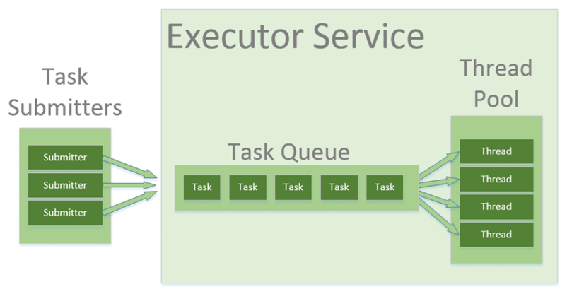

자바 스레드 프로그래밍 Future, Executor 관련 클래스들을 공부하면서 계속 나오는 스레드 풀 `Thread Pool` 에 대해 알아보고자 한다. 해외 사이트 문서를 이용하여 실제 자바에서 스레드 풀이 어떻게 구현되는지도 간단히 알아보았다.

## 개념

_출처 : https://www.baeldung.com/thread-pool-java-and-guava_

미리 일정 개수의 스레드를 미리 생성해 보관하고 있다가, 작업 요청이 발생하면 미리 생성해 둔 스래드로 작업을 처리하는 방식을 말한다. 이 때 작업이 끝난 스레드는 종료되지 않으며 다음 작업 요청이 들어올 때까지 대기했다가 재사용된다.

### Pool, 풀이 왜 생겨났을까?
컴퓨터 과학에서 Pool은 메모리 위에 사용할 준비가 된 자원을 일정량 미리 만들어 둔 자원의 집합이다. 미리 만들어 두었기 때문에 새로 자원을 생성하지 않고 풀에서 꺼내 사용하고, 사용이 완료되면 풀에 다시 반환하는 형태로 사용된다.

미리 자원을 생성해 두었기 때문에 자원의 생성, 소멸 비용을 절약할 수 있다. 풀은 그냥 가져다 쓰기만 하면 된다. 자원의 생성, 소멸 비용을 절약할 수 있기 때문에 생겨난 것이 아닐까?

**스레드 풀 이외에 다른 풀은 어떤 것이 있을까?**

- Connection Pool, 커넥션 풀
	- DB와 연결하는 것은 꽤 큰 비용이 든다. 미리 DB 커넥션을 만들어 두고 필요할 때마다 이 커넥션을 재사용하는 방식이다.
- String Pool, 스트링 풀
	- Java String을 효율적으로 관리하기 위해 동일한 문자열 리터럴이 생성될 때, 새로 생성하지 않고 String Pool 내에 저장된 문자열을 그대로 참조한다.

## 왜 쓸까
작업 요청이 들어올 때마다 스레드를 매번 생성하고 작업을 할당하면 안 될까?

- 스레드 생성, 소멸 비용 절감<br/>
    스레드를 매번 생성하고 소멸하는 작업은 오버헤드가 발생한다. 스레드를 생성할 때 필요한 메모리 공간을 할당하는 과정에서 CPU, 메모리 자원을 소모하며 OS는 새로운 스레드 스택을 할당하고 스케줄러에 등록 하는 등 초기화에 많은 비용이 든다. 스레드 해제 시에도 스레드가 사용한 메모리를 해제하는 과정에서 컨텍스트 정리를 위한 오버헤드를 유발한다.

    스레드 풀을 사용하면 새로운 작업이 발생할 때마다 스레드를 새로 생성하지 않고 미리 만들어 둔 스레들을 재사용하여 생성, 소멸에 대한 비용을 줄여 효율적으로 스레드를 관리할 수 있다.

- 리소스 관리<br/>
    스레드 풀이 없다면 대량의 요청이 발생했을 때 요청에 대해 많은 양의 스레드 생성, 해제 작업으로 컴퓨팅 자원을 소모하게 되어 이는 애플리케이션의 성능 저하로 이어질 수 있다.

    스레드 풀을 사용하면 동시에 실행될 수 있는 스레드의 양이 제한되어 있어 스레드 폭증으로 인한 애플리케이션 성능 저하를 방지할 수 있다.

    또한 요청이 폭증하여 사용할 수 있는 스레드가 없는 경우, 작업 큐에 대기하며 처리 순서가 관리된다. 사용 가능한 스레드가 생기면 일정한 순서대로 처리되도록 보장하여 리소스 부족 시 효율적으로 대처할 수 있다.

### 단점은 없을까?
- 메모리 낭비<br/>
	스레드 풀은 일정 수의 스레드를 미리 만들어두는데, 너무 많은 스레드를 생성해 두고 다 사용하지 않으면 메모리만 차지하고 노는 스레드가 존재하게 되어 메모리 낭비로 이어질 수 있다.

- 풀 크기 설정의 어려움
	크기를 너무 작게 설정하면 동시 작업을 효율적으로 처리하지 못하여 성능이 저하될 수 있다. 반대로 너무 크게 설정하면 과도한 스레드 생성으로 인한 오버헤드, 자원 낭비가 발생한다.

- 작업의 특성에 따른 비효율
	스레드 풀의 스레드가 다 사용 중인 상태에서 대기 큐에 I/O 바운드 작업, 네트워크 연결을 기다리는 작업이 있으면 애플리케이션 성능이 급격히 저하될 수 있다.


## Thread Pool in Java
### Executors, Executor and ExecutorService
`Executors` 헬퍼 클래스는 스레드 풀 인스턴스를 만드는 데 필요한 여러 메서드를 제공한다.

`Executor, ExecutorService` 인터페이스를 사용하여 Java에서 다양한 형태의 스레드 풀을 구현할 수 있다. 

#### Executor
`Executor` 인터페이스에는 `Runnable` 인스턴스를 실행하기 위한 execute() 메서드가 존재한다.

```java
Executor executor = Executors.newSingleThreadExecutor();
executor.execute(() -> System.out.println("Hello World"));
```

위 코드는 단순히 화면에 'Hello World' 문자열을 출력하는 단일 작업을 수행한다. 단일 스레드 풀과 작업을 순차적으로 실행하기 위한 무제한 대기열 `queue` 이다.

#### ExecutorService
`ExecutorService` 인터페이스는 작업 진행을 제어하고 서비스의 종료를 관리하는 다양한 메소드를 제공한다. 이 인터페이스를 사용하여 실행을 위한 작업을 `submit`하고 리턴된 `Future` 인스턴스를 사용하여 작업의 수행을 제어한다.

```java
ExecutorService executorService = Executors.newFixedThreadPool(10);
Future<String> future = executorService.submit(() -> "Hello World");
// some operations
String result = future.get();
```

### ThreadPoolExecutor
`ThreadPoolExecutor`는 다양한 파라미터와 튜닝을 위한 hooks을 제공하여 다양한 형태의 스레드 풀을 구현할 수 있다.

스레드 풀은 내부에 항상 유지되는 고정된 수의 **<u>코어 스레드</u>**와 생성되었다 더 이상 필요없을 때 제거될 수 있는 **<u>여분의 스레드</u>**로 구성된다.

주요 파라미터는 다음과 같다.

- corePoolSize
	- 스레드 풀이 유지하는 최소 스레드 수
	- 인스턴스화 되어 풀에 보관되는 코어 스레드 수
	
- maximumPoolSize
  - 스레드 풀이 생성할 수 있는 최대 스레드 개수
  - 새 작업이 들어왔을 때 모든 코어 스레드가 바쁘고 내부 큐가 가득찬 경우 스레드 풀의 크기는 maximumPoolSize까지 커질 수 있다.

- keepAliveTime
  - corePoolSize를 초과하여 인스턴스화된 유휴 상태의 스레드가 유지될 수 있는 최대 시간
  - 기본적으로 `ThreadPoolExecutor`는 제거할 때 코어 스레드가 아닌 여분의 스레드에만 적용된다. 코어 스레드에도 동일한 제거 정책을 적용하기 위해 `allowCoreThreadTimeOut(true)` 메서드를 호출할 수 있다.

위 파라미터를 활용한 일반적인 구성은 `Executors` static 메서드에 정의되어 있다.

1. Executors.newFixedThreadPool(int nThreads)

    `Executors`의 내부 구현 코드를 보면
    ```java
    public class Executors {
        /**
         * Creates a thread pool that reuses a fixed number of threads
         * operating off a shared unbounded queue.  At any point, at most
         * {@code nThreads} threads will be active processing tasks.
         * If additional tasks are submitted when all threads are active,
         * they will wait in the queue until a thread is available.
         * If any thread terminates due to a failure during execution
         * prior to shutdown, a new one will take its place if needed to
         * execute subsequent tasks.  The threads in the pool will exist
         * until it is explicitly {@link ExecutorService#shutdown shutdown}.
         *
         * @param nThreads the number of threads in the pool
         * @return the newly created thread pool
         * @throws IllegalArgumentException if {@code nThreads <= 0}
         */
        public static ExecutorService newFixedThreadPool(int nThreads) {
            return new ThreadPoolExecutor(nThreads, nThreads,
                                          0L, TimeUnit.MILLISECONDS,
                                          new LinkedBlockingQueue<Runnable>());
        }
    ...
    ```

    호출하는 `ThreadPoolExecutor` 생성자의 구현 코드를 보면
    ```java
    public class ThreadPoolExecutor extends AbstractExecutorService {
    ...
        public ThreadPoolExecutor(int corePoolSize,
                                  int maximumPoolSize,
                                  long keepAliveTime,
                                  TimeUnit unit,
                                  BlockingQueue<Runnable> workQueue) {
            this(corePoolSize, maximumPoolSize, keepAliveTime, unit, workQueue,
                 Executors.defaultThreadFactory(), defaultHandler);
        }
    ...
    ```
    maximumPoolSize와 corePoolSize가 동일하기 때문에 대기 큐에 요청이 쌓인다고 해서 스레드를 더 생성하지 않음을 알 수 있다.

    keepAliveTime = 0인데 corePoolSize를 초과해서 스레드가 생성되지 않으므로 큰 의미가 없다.

    `LinkedBlockingQueue`의 생성자 구현 코드를 보면 
    ```java
    public class LinkedBlockingQueue<E> extends AbstractQueue<E> {
    ...
        /**
         * Creates a {@code LinkedBlockingQueue} with a capacity of
         * {@link Integer#MAX_VALUE}.
         */
        public LinkedBlockingQueue() {
            this(Integer.MAX_VALUE);
        }
    ...
    }
    ```
    workingQueue 생성 시 디폴트 사이즈가 `Integer.MAX_VALUE`로 사실상 무제한이다.

    다음은 간단한 테스트 코드이다.
    ```java
    ThreadPoolExecutor executor = (ThreadPoolExecutor) Executors.newFixedThreadPool(2);
    executor.submit(() -> {
        Thread.sleep(1000);
        return null;
    });
    executor.submit(() -> {
        Thread.sleep(1000);
        return null;
    });
    executor.submit(() -> {
        Thread.sleep(1000);
        return null;
    });

    System.out.println(executor.getPoolSize());
    System.out.println(executor.getQueue().size());
    ```
    ```console
    2
    1
    ```
    크기 2인 고정 사이즈의 스레드 풀을 생성했다. 3개의 작업을 `submit`했지만 동시에 2개의 작업만 실행 가능하므로 대기 큐에 마지막에 `submit`한 작업이 들어가게 된다.

    따라서 poolSize는 2이고, queue의 사이즈는 1이 된다.


2. Executors.newCachedThreadPool()

    이 메서드는 스레드 수를 전혀 받지 않는다. 내부 구현 코드를 보면,

    ```java
    public class Executors {
        /**
         * Creates a thread pool that creates new threads as needed, but
         * will reuse previously constructed threads when they are
         * available.  These pools will typically improve the performance
         * of programs that execute many short-lived asynchronous tasks.
         * Calls to {@code execute} will reuse previously constructed
         * threads if available. If no existing thread is available, a new
         * thread will be created and added to the pool. Threads that have
         * not been used for sixty seconds are terminated and removed from
         * the cache. Thus, a pool that remains idle for long enough will
         * not consume any resources. Note that pools with similar
         * properties but different details (for example, timeout parameters)
         * may be created using {@link ThreadPoolExecutor} constructors.
         *
         * @return the newly created thread pool
         */
        public static ExecutorService newCachedThreadPool() {
            return new ThreadPoolExecutor(0, Integer.MAX_VALUE,
                                          60L, TimeUnit.SECONDS,
                                          new SynchronousQueue<Runnable>());
        }
    ```
    corePoolSize를 0으로 설정하고 maximumPoolSize를 Integer.MAX_VALUE로 설정한다. keepAliveTime은 60초다.

    파라미터 값을 통해 스레드 풀이 제한 없이 스레드 풀이 커질 수 있음을 알 수 있다. 그러나 스레드가 더 이상 필요 없을 때 60초 동안 활동성이 없으면 폐기된다. 애플리케이션에 주로 수명이 짧은 작업이 많은 경은 경우에 사용된다.

    내부적으로 SynchronousQueue 인스턴스가 사용되기 때문에 대기열 크기는 항상 0이다. SynchronousQueue에서 삽입 및 제거 작업은 항상 동시에 발생한다. 따라서 대기열에는 실제로 아무것도 포함되지 않는다.

    다음은 간단한 테스트 코드이다.
    ```java
    ThreadPoolExecutor executor = (ThreadPoolExecutor) Executors.newCachedThreadPool();
    executor.submit(() -> {
        Thread.sleep(1000);
        return null;
    });
    executor.submit(() -> {
        Thread.sleep(1000);
        return null;
    });
    executor.submit(() -> {
        Thread.sleep(1000);
        return null;
    });

    System.out.println(executor.getPoolSize());
    System.out.println(executor.getQueue().size());
    ```
    ```console
    3
    0
    ```
    처음 풀 생성 시 0으로 생성됬을 것이지만, `submit`을 3번 했기 때문에 풀의 크기는 3이 된다. 큐 사이즈가 0인 이유는 스레드 풀에서 스레드를 받아 큐에 대기중인 작업이 없기 때문이다.

3. Executors.newSingleThreadExecutor()

    이 메소드는 싱글 스레드를 포함하는 ThreadPoolExecutor를 생성한다. `SingleThreadExecutor`는 이벤트 루프를 만드는 데 이상적이다.

    내부 구현 코드를 보면,

    ```java
    public class Executors {
    ...
        /**
         * Creates an Executor that uses a single worker thread operating
         * off an unbounded queue. (Note however that if this single
         * thread terminates due to a failure during execution prior to
         * shutdown, a new one will take its place if needed to execute
         * subsequent tasks.)  Tasks are guaranteed to execute
         * sequentially, and no more than one task will be active at any
         * given time. Unlike the otherwise equivalent
         * {@code newFixedThreadPool(1)} the returned executor is
         * guaranteed not to be reconfigurable to use additional threads.
         *
         * @return the newly created single-threaded Executor
         */
        public static ExecutorService newSingleThreadExecutor() {
            return new FinalizableDelegatedExecutorService
                (new ThreadPoolExecutor(1, 1,
                                        0L, TimeUnit.MILLISECONDS,
                                        new LinkedBlockingQueue<Runnable>()));
    ```
    corePoolSize, maximumPoolSize는 1이고, keepAliveTime 은 0임을 확인할 수 있다.

    다음은 간단한 테스트 코드이다.
    ```java
    AtomicInteger counter = new AtomicInteger();

    ExecutorService executor = Executors.newSingleThreadExecutor();
    executor.submit(() -> {
        counter.set(1);
    });
    executor.submit(() -> {
        counter.compareAndSet(1, 2);
    });
    ```
    ```console
    2
    ```
    작업이 순차적으로 수행되기 때문에 수행 후 `counter` 값은 2이다.

    또한 이 ThreadPoolExecutor는 Immutable Wrapper로 랩핑되어 있으므로 생성 후 재구성될 수 없다. 그렇기 때문에 `ThreadPoolExecutor`로 캐스팅할 수 없다.

### ScheduledThreadPoolExecutor
ScheduledThreadPoolExecutor는 `ThreadPoolExecutor` 클래스를 확장하고 여러 추가 메서드와 함께 `ScheduledExecutorService` 인터페이스를 구현한다.
- `schedule` 메서드는 지정된 딜레이 타임 후에 작업을 수행하도록 설정한다.

```java
/**
 * Submits a periodic action that becomes enabled first after the
 * given initial delay, and subsequently with the given period;
 * that is, executions will commence after
 * {@code initialDelay}, then {@code initialDelay + period}, then
 * {@code initialDelay + 2 * period}, and so on.
 *
 * <p>The sequence of task executions continues indefinitely until
 * one of the following exceptional completions occur:
 * <ul>
 * <li>The task is {@linkplain Future#cancel explicitly cancelled}
 * via the returned future.
 * <li>Method {@link #shutdown} is called and the {@linkplain
 * #getContinueExistingPeriodicTasksAfterShutdownPolicy policy on
 * whether to continue after shutdown} is not set true, or method
 * {@link #shutdownNow} is called; also resulting in task
 * cancellation.
 * <li>An execution of the task throws an exception.  In this case
 * calling {@link Future#get() get} on the returned future will throw
 * {@link ExecutionException}, holding the exception as its cause.
 * </ul>
 * Subsequent executions are suppressed.  Subsequent calls to
 * {@link Future#isDone isDone()} on the returned future will
 * return {@code true}.
 *
 * <p>If any execution of this task takes longer than its period, then
 * subsequent executions may start late, but will not concurrently
 * execute.
 *
 * @throws RejectedExecutionException {@inheritDoc}
 * @throws NullPointerException       {@inheritDoc}
 * @throws IllegalArgumentException   {@inheritDoc}
 */
public ScheduledFuture<?> scheduleAtFixedRate(Runnable command,
                                              long initialDelay,
                                              long period,
                                              TimeUnit unit) {
```
- `scheduleAtFixedRate` 메서드는 지정된 초기 딜레이 후에 작업을 실행한 다음 특정 주기동안 반복적으로 실행할 수 있게 해 준다. `period` 파라미터는 작업의 시작 시간 사이에 측정된 시간이므로 실행 속도가 고정된다.

```java
/**
 * Submits a periodic action that becomes enabled first after the
 * given initial delay, and subsequently with the given delay
 * between the termination of one execution and the commencement of
 * the next.
 *
 * <p>The sequence of task executions continues indefinitely until
 * one of the following exceptional completions occur:
 * <ul>
 * <li>The task is {@linkplain Future#cancel explicitly cancelled}
 * via the returned future.
 * <li>Method {@link #shutdown} is called and the {@linkplain
 * #getContinueExistingPeriodicTasksAfterShutdownPolicy policy on
 * whether to continue after shutdown} is not set true, or method
 * {@link #shutdownNow} is called; also resulting in task
 * cancellation.
 * <li>An execution of the task throws an exception.  In this case
 * calling {@link Future#get() get} on the returned future will throw
 * {@link ExecutionException}, holding the exception as its cause.
 * </ul>
 * Subsequent executions are suppressed.  Subsequent calls to
 * {@link Future#isDone isDone()} on the returned future will
 * return {@code true}.
 *
 * @throws RejectedExecutionException {@inheritDoc}
 * @throws NullPointerException       {@inheritDoc}
 * @throws IllegalArgumentException   {@inheritDoc}
 */
public ScheduledFuture<?> scheduleWithFixedDelay(Runnable command,
                                                 long initialDelay,
                                                 long delay,
                                                 TimeUnit unit) {
```
- `scheduleWithFixedDelay` 메서드는 주어진 작업을 반복적으로 실행한다는 점에서 `scheduleAtFixedRate` 메서드와 유사하지만, 지정된 딜레이 타임은 이전 작업의 끝과 다음 작업의 시작 시간 사이에서 측정된다. 실행 속도는 주어진 작업을 실행하는데 걸리는 시간에 따라 달라질 수 있다.


일반적으로 `Executors.newScheduledThreadPool()` 메서드를 사용하여 지정된 corePoolSize, 제한 없는 maximumPoolSize 및 keepAliveTime = 0을 갖는 ScheduledThreadPoolExecutor 를 생성한다.

500ms 내에 실행되도록 작업을 예약하는 방법은 다음과 같다.

```java
ScheduledExecutorService executor = Executors.newScheduledThreadPool(5);
executor.schedule(() -> {
    System.out.println("Hello World");
}, 500, TimeUnit.MILLISECONDS);
```

다음 코드는 500ms 지연 후 작업을 실행한 다음 100ms마다 반복하는 방법을 보여준다. 작업을 예약한 후 CountDownLatch 잠금을 사용하여 세 번 실행될 때까지 기다린 후 Future.cancel() 메서드를 사용하여 취소한다.

```java
CountDownLatch lock = new CountDownLatch(3);
ScheduledExecutorService executor = Executors.newScheduledThreadPool(5);
ScheduledFuture<?> future = executor.scheduleAtFixedRate(() -> {
    System.out.println("Hello World");
    lock.countDown();
}, 500, 100, TimeUnit.MILLISECONDS);

lock.await(1000, TimeUnit.MILLISECONDS);
future.cancel(true);
```

### ForkJoinPool
ForkJoinPool은 Java 7에 도입된 Fork/Join Framework의 핵심이다. 재귀 방식으로 여러 작업을 나누어 문제를 해결한다. 서브 태스크를 포함한 모든 작업은 실행되기 위해 자체 스레드가 필요하므로 간단한 `ThreadPoolExecutor`를 사용하면 스레드가 빠르게 소진된다.

Fork/Join Framework에서 모든 작업은 수많은 여러 서브 태스크를 생성(`fork`) 하고 `join` 메서드를 사용하여 서브 태스크들의 완료될 때까지 기다린다. 이 프레임워크의 장점은 각 작업 및 서브 태스크를 위한 새로운 스레드를 생성하지 않는 대신 Work Stealing 알고리즘을 구현한다는 점이다.

ForkJoinPool을 사용하여 노드 트리를 탐색하고 모든 리프 값의 합을 계산하는 간단한 예제 코드이다.
```java
public class CountingTask extends RecursiveTask<Integer> {

    private final TreeNode node;

    public CountingTask(TreeNode node) {
        this.node = node;
    }

    @Override
    protected Integer compute() {
        return node.value + node.children.stream()
                .map(childNode -> new CountingTask(childNode).fork())
                .collect(Collectors.summingInt(ForkJoinTask::join));
    }

    public static void main(String[] args) {
        TreeNode tree = new TreeNode(5,
                new TreeNode(3), new TreeNode(2,
                new TreeNode(2), new TreeNode(8)));

        ForkJoinPool forkJoinPool = ForkJoinPool.commonPool();
        int sum = forkJoinPool.invoke(new CountingTask(tree));
        System.out.println(sum);
    }
    
    static class TreeNode {
        int value;
        Set<TreeNode> children;

        TreeNode(int value, TreeNode... children) {
            this.value = value;
            this.children = new HashSet<>(Arrays.asList(children));
        }
    }
}
```
트리의 모든 값을 병렬로 합산하려면 `RecursiveTask<Integer>` 클래스를 확장해야 한다. 각 작업은 자체 토드를 받고 해당 값을 자식 값의 합에 더한다.

자식 값의 합을 계산하기 위해 작업 구현은 다음을 수행한다.
1. 자식 set의 stream을 만든다.
2. 이 stream의 map을 만들고 각 요소에 대해 새 CountingTask를 생성한다.
3. 각 서브 태스크를 fork 하여 실행한다.
4. fork된 각 작업에서 join 메서드를 호출하여 결과를 collect 한다.
5. `Collectors.summingInt` 컬렉터를 사용하여 결과를 합산한다.


## References
- gpt4o
- https://www.baeldung.com/thread-pool-java-and-guava
- https://tecoble.techcourse.co.kr/post/2021-09-18-java-thread-pool/